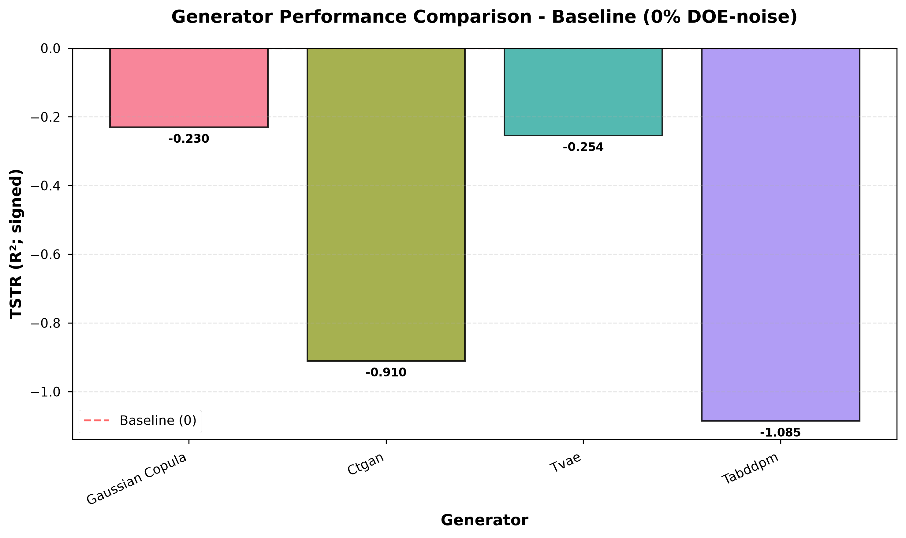
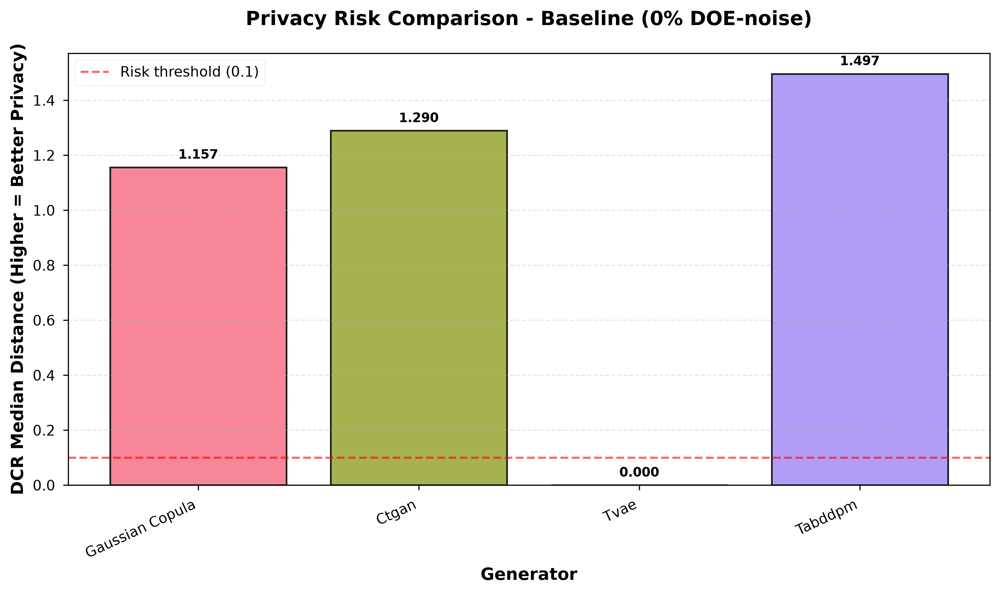
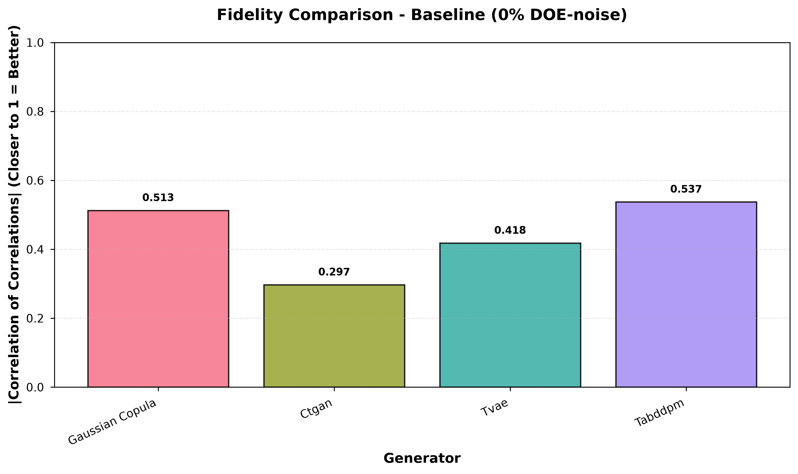
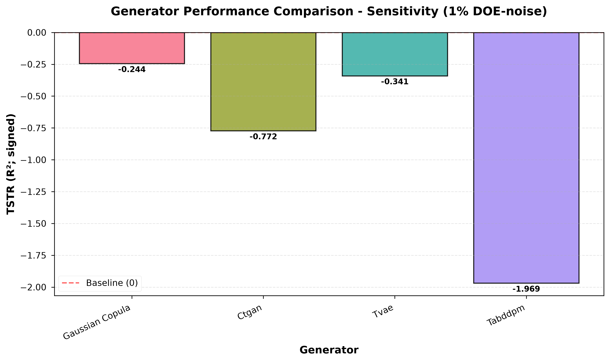
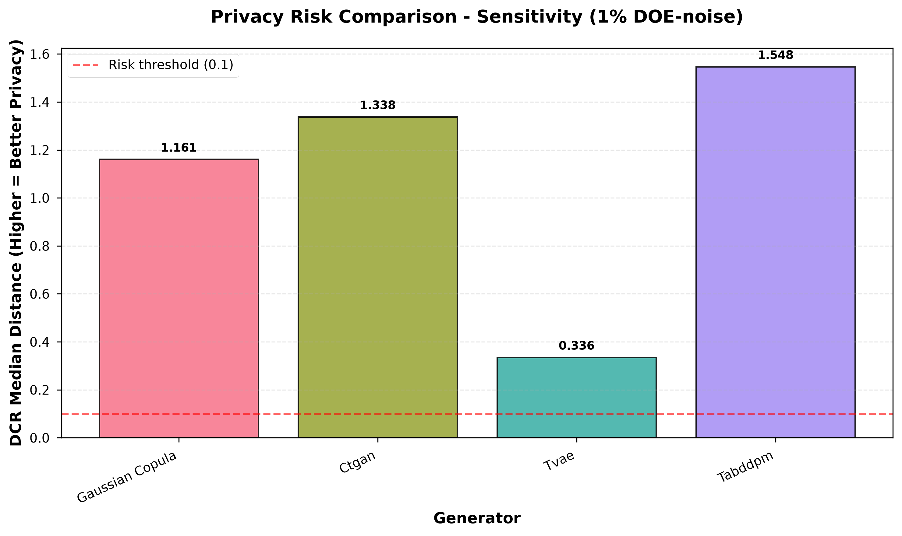
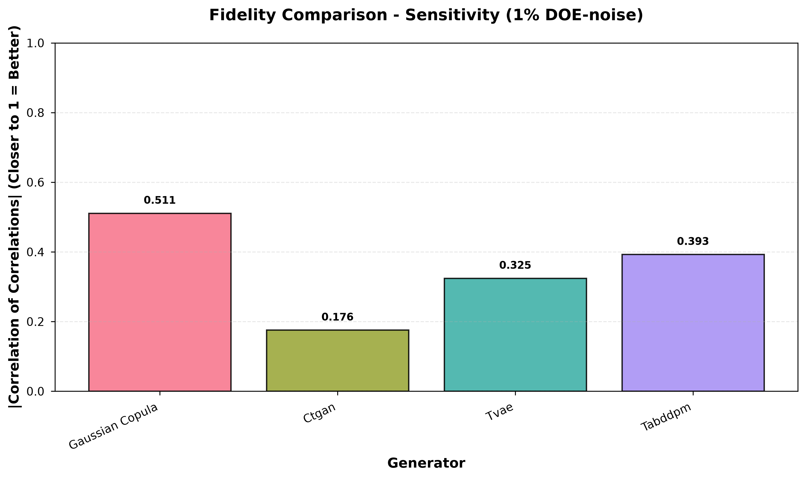

# Q1/Q2 Consolidated Report (Baseline 0% vs Sensitivity 1%)

Generated at (UTC): 2026-07-10 04:54:42Z

## Inputs

- Real dataset: `dados.csv`
- Target: `surface_tension_mNm`

Scenario output roots:
- Baseline scenario dir: `C:\Users\famg\Downloads\Synthetic-Expansion-of-Bench-Scale-Experimental-Data--2\runs\exp_out_v5_doe0pct_tau010`
- Baseline bundle dir: `C:\Users\famg\Downloads\Synthetic-Expansion-of-Bench-Scale-Experimental-Data--2\runs\exp_out_v5_doe0pct_tau010\bundle_q1q2`
- Sensitivity scenario dir: `C:\Users\famg\Downloads\Synthetic-Expansion-of-Bench-Scale-Experimental-Data--2\runs\exp_out_v5_doe1pct_tau010`
- Sensitivity bundle dir: `C:\Users\famg\Downloads\Synthetic-Expansion-of-Bench-Scale-Experimental-Data--2\runs\exp_out_v5_doe1pct_tau010\bundle_q1q2`

## Cross-scenario summary (utility, fidelity, privacy)

| Generator | Baseline TSTR (R²) | Sensitivity TSTR (R²) | Δ (Sens−Base) | Baseline |corr| (abs) | Sensitivity |corr| (abs) | Baseline DCR median | Sensitivity DCR median | Baseline frac(DCR<0.1) | Sensitivity frac(DCR<0.1) | Baseline MIA AUC | Sensitivity MIA AUC |
|---|---:|---:|---:|---:|---:|---:|---:|---:|---:|---:|---:|
| ctgan | -0.910 | -0.772 | 0.138 | 0.297 | 0.176 | 1.290 | 1.338 | 0.036 | 0.064 | — | — |
| gaussian_copula | -0.230 | -0.244 | -0.015 | 0.513 | 0.511 | 1.157 | 1.161 | 0.193 | 0.193 | — | — |
| tabddpm | -1.085 | -1.969 | -0.884 | 0.537 | 0.393 | 1.497 | 1.548 | 0.207 | 0.243 | — | — |
| tvae | -0.254 | -0.341 | -0.087 | 0.418 | 0.325 | 0.000 | 0.336 | 0.579 | 0.436 | — | — |

## Scenario sections

### Baseline (0% DOE-noise)

- Scenario dir: `C:\Users\famg\Downloads\Synthetic-Expansion-of-Bench-Scale-Experimental-Data--2\runs\exp_out_v5_doe0pct_tau010`
- Bundle dir: `C:\Users\famg\Downloads\Synthetic-Expansion-of-Bench-Scale-Experimental-Data--2\runs\exp_out_v5_doe0pct_tau010\bundle_q1q2`
- Eval JSON: `C:\Users\famg\Downloads\Synthetic-Expansion-of-Bench-Scale-Experimental-Data--2\runs\exp_out_v5_doe0pct_tau010\evaluation_results.json`
- Config JSON: `C:\Users\famg\Downloads\Synthetic-Expansion-of-Bench-Scale-Experimental-Data--2\runs\exp_out_v5_doe0pct_tau010\experiment_config.json`

- Report: (not found in bundle dir; check runner logs)

#### Key figures

**FIG1**

**FIG2**

**FIG3**

#### Figure diagnostics (verbose)

- [fig] Baseline (0% DOE-noise): candidate roots:
-   - C:\Users\famg\Downloads\Synthetic-Expansion-of-Bench-Scale-Experimental-Data--2\runs\exp_out_v5_doe0pct_tau010\bundle_q1q2\q1q2_figures
-   - C:\Users\famg\Downloads\Synthetic-Expansion-of-Bench-Scale-Experimental-Data--2\runs\exp_out_v5_doe0pct_tau010\bundle_q1q2\figures
-   - C:\Users\famg\Downloads\Synthetic-Expansion-of-Bench-Scale-Experimental-Data--2\runs\exp_out_v5_doe0pct_tau010\bundle_q1q2
-   - C:\Users\famg\Downloads\Synthetic-Expansion-of-Bench-Scale-Experimental-Data--2\runs\exp_out_v5_doe0pct_tau010\bundle_q1q2\q1q2_figures
-   - C:\Users\famg\Downloads\Synthetic-Expansion-of-Bench-Scale-Experimental-Data--2\runs\exp_out_v5_doe0pct_tau010\q1q2_figures
- [fig] Baseline (0% DOE-noise): selected root: C:\Users\famg\Downloads\Synthetic-Expansion-of-Bench-Scale-Experimental-Data--2\runs\exp_out_v5_doe0pct_tau010\bundle_q1q2\q1q2_figures
- [fig] copied fig1: C:\Users\famg\Downloads\Synthetic-Expansion-of-Bench-Scale-Experimental-Data--2\runs\exp_out_v5_doe0pct_tau010\bundle_q1q2\q1q2_figures\fig1_utility_comparison.png -> C:\Users\famg\Downloads\Synthetic-Expansion-of-Bench-Scale-Experimental-Data--2\outputs\q1q2_final_consolidated\figures\baseline\fig1_utility_comparison.png
- [fig] copied fig1 pdf: C:\Users\famg\Downloads\Synthetic-Expansion-of-Bench-Scale-Experimental-Data--2\runs\exp_out_v5_doe0pct_tau010\bundle_q1q2\q1q2_figures\fig1_utility_comparison.pdf -> C:\Users\famg\Downloads\Synthetic-Expansion-of-Bench-Scale-Experimental-Data--2\outputs\q1q2_final_consolidated\figures\baseline\fig1_utility_comparison.pdf
- [fig] copied fig2: C:\Users\famg\Downloads\Synthetic-Expansion-of-Bench-Scale-Experimental-Data--2\runs\exp_out_v5_doe0pct_tau010\bundle_q1q2\q1q2_figures\fig2_privacy_comparison.png -> C:\Users\famg\Downloads\Synthetic-Expansion-of-Bench-Scale-Experimental-Data--2\outputs\q1q2_final_consolidated\figures\baseline\fig2_privacy_comparison.png
- [fig] copied fig2 pdf: C:\Users\famg\Downloads\Synthetic-Expansion-of-Bench-Scale-Experimental-Data--2\runs\exp_out_v5_doe0pct_tau010\bundle_q1q2\q1q2_figures\fig2_privacy_comparison.pdf -> C:\Users\famg\Downloads\Synthetic-Expansion-of-Bench-Scale-Experimental-Data--2\outputs\q1q2_final_consolidated\figures\baseline\fig2_privacy_comparison.pdf
- [fig] copied fig3: C:\Users\famg\Downloads\Synthetic-Expansion-of-Bench-Scale-Experimental-Data--2\runs\exp_out_v5_doe0pct_tau010\bundle_q1q2\q1q2_figures\fig3_fidelity_comparison.png -> C:\Users\famg\Downloads\Synthetic-Expansion-of-Bench-Scale-Experimental-Data--2\outputs\q1q2_final_consolidated\figures\baseline\fig3_fidelity_comparison.png
- [fig] copied fig3 pdf: C:\Users\famg\Downloads\Synthetic-Expansion-of-Bench-Scale-Experimental-Data--2\runs\exp_out_v5_doe0pct_tau010\bundle_q1q2\q1q2_figures\fig3_fidelity_comparison.pdf -> C:\Users\famg\Downloads\Synthetic-Expansion-of-Bench-Scale-Experimental-Data--2\outputs\q1q2_final_consolidated\figures\baseline\fig3_fidelity_comparison.pdf

### Sensitivity (1% DOE-noise)

- Scenario dir: `C:\Users\famg\Downloads\Synthetic-Expansion-of-Bench-Scale-Experimental-Data--2\runs\exp_out_v5_doe1pct_tau010`
- Bundle dir: `C:\Users\famg\Downloads\Synthetic-Expansion-of-Bench-Scale-Experimental-Data--2\runs\exp_out_v5_doe1pct_tau010\bundle_q1q2`
- Eval JSON: `C:\Users\famg\Downloads\Synthetic-Expansion-of-Bench-Scale-Experimental-Data--2\runs\exp_out_v5_doe1pct_tau010\evaluation_results.json`
- Config JSON: `C:\Users\famg\Downloads\Synthetic-Expansion-of-Bench-Scale-Experimental-Data--2\runs\exp_out_v5_doe1pct_tau010\experiment_config.json`

- Report: (not found in bundle dir; check runner logs)

#### Key figures

**FIG1**

**FIG2**

**FIG3**

#### Figure diagnostics (verbose)

- [fig] Sensitivity (1% DOE-noise): candidate roots:
-   - C:\Users\famg\Downloads\Synthetic-Expansion-of-Bench-Scale-Experimental-Data--2\runs\exp_out_v5_doe1pct_tau010\bundle_q1q2\q1q2_figures
-   - C:\Users\famg\Downloads\Synthetic-Expansion-of-Bench-Scale-Experimental-Data--2\runs\exp_out_v5_doe1pct_tau010\bundle_q1q2\figures
-   - C:\Users\famg\Downloads\Synthetic-Expansion-of-Bench-Scale-Experimental-Data--2\runs\exp_out_v5_doe1pct_tau010\bundle_q1q2
-   - C:\Users\famg\Downloads\Synthetic-Expansion-of-Bench-Scale-Experimental-Data--2\runs\exp_out_v5_doe1pct_tau010\bundle_q1q2\q1q2_figures
-   - C:\Users\famg\Downloads\Synthetic-Expansion-of-Bench-Scale-Experimental-Data--2\runs\exp_out_v5_doe1pct_tau010\q1q2_figures
- [fig] Sensitivity (1% DOE-noise): selected root: C:\Users\famg\Downloads\Synthetic-Expansion-of-Bench-Scale-Experimental-Data--2\runs\exp_out_v5_doe1pct_tau010\bundle_q1q2\q1q2_figures
- [fig] copied fig1: C:\Users\famg\Downloads\Synthetic-Expansion-of-Bench-Scale-Experimental-Data--2\runs\exp_out_v5_doe1pct_tau010\bundle_q1q2\q1q2_figures\fig1_utility_comparison.png -> C:\Users\famg\Downloads\Synthetic-Expansion-of-Bench-Scale-Experimental-Data--2\outputs\q1q2_final_consolidated\figures\sensitivity\fig1_utility_comparison.png
- [fig] copied fig1 pdf: C:\Users\famg\Downloads\Synthetic-Expansion-of-Bench-Scale-Experimental-Data--2\runs\exp_out_v5_doe1pct_tau010\bundle_q1q2\q1q2_figures\fig1_utility_comparison.pdf -> C:\Users\famg\Downloads\Synthetic-Expansion-of-Bench-Scale-Experimental-Data--2\outputs\q1q2_final_consolidated\figures\sensitivity\fig1_utility_comparison.pdf
- [fig] copied fig2: C:\Users\famg\Downloads\Synthetic-Expansion-of-Bench-Scale-Experimental-Data--2\runs\exp_out_v5_doe1pct_tau010\bundle_q1q2\q1q2_figures\fig2_privacy_comparison.png -> C:\Users\famg\Downloads\Synthetic-Expansion-of-Bench-Scale-Experimental-Data--2\outputs\q1q2_final_consolidated\figures\sensitivity\fig2_privacy_comparison.png
- [fig] copied fig2 pdf: C:\Users\famg\Downloads\Synthetic-Expansion-of-Bench-Scale-Experimental-Data--2\runs\exp_out_v5_doe1pct_tau010\bundle_q1q2\q1q2_figures\fig2_privacy_comparison.pdf -> C:\Users\famg\Downloads\Synthetic-Expansion-of-Bench-Scale-Experimental-Data--2\outputs\q1q2_final_consolidated\figures\sensitivity\fig2_privacy_comparison.pdf
- [fig] copied fig3: C:\Users\famg\Downloads\Synthetic-Expansion-of-Bench-Scale-Experimental-Data--2\runs\exp_out_v5_doe1pct_tau010\bundle_q1q2\q1q2_figures\fig3_fidelity_comparison.png -> C:\Users\famg\Downloads\Synthetic-Expansion-of-Bench-Scale-Experimental-Data--2\outputs\q1q2_final_consolidated\figures\sensitivity\fig3_fidelity_comparison.png
- [fig] copied fig3 pdf: C:\Users\famg\Downloads\Synthetic-Expansion-of-Bench-Scale-Experimental-Data--2\runs\exp_out_v5_doe1pct_tau010\bundle_q1q2\q1q2_figures\fig3_fidelity_comparison.pdf -> C:\Users\famg\Downloads\Synthetic-Expansion-of-Bench-Scale-Experimental-Data--2\outputs\q1q2_final_consolidated\figures\sensitivity\fig3_fidelity_comparison.pdf

